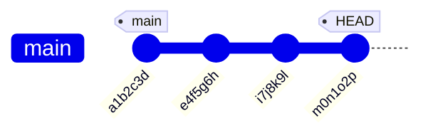
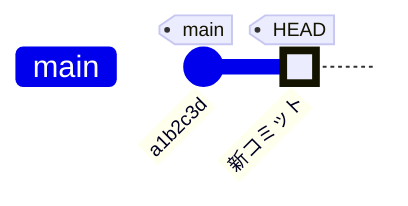

日常の開発で役立つ Git コマンドとワークフローをまとめました。「あのコマンドなんだっけ？」というときに逆引きできる形で整理しています。Git の基本操作には慣れてきたけれど、コミットの修正や rebase をもっと使いこなしたいという方を想定しています。

---

## コミットの修正

### 直前のコミットにファイルを追加する

```bash
git commit --amend --no-edit
```

ステージングに追加した変更を、直前のコミットにそのまま取り込みます。コミットメッセージは変更しません。「あ、このファイルも含めるべきだった」というときに便利です。

### 直前のコミットメッセージを書き換える

```bash
git commit --amend -m "新しいコミットメッセージ"
```

コミットメッセージの typo 修正や、より適切な説明に差し替えたいときに使います。ステージングに変更があれば、それも同時に取り込まれます。

### 過去のコミットを編集する（インタラクティブ rebase）

```bash
git rebase -i 
```

直前より前のコミットを修正・並べ替え・統合（squash）したい場合に使います。

`<基点となるコミット>` にはコミットハッシュ（例: `a1b2c3d`）と相対指定（例: `HEAD~3`）のどちらも使えます。コミットハッシュは `git log` で確認できます。相対指定のほうが手軽なので、以下では `HEAD~n` の数え方を詳しく説明します。

### `HEAD~n` の数え方と編集対象

`HEAD~n` は「HEAD から n 個前のコミット」を指します。

```
A --- B --- C --- D (HEAD)
      ↑     ↑     ↑
   HEAD~3  HEAD~2  HEAD~1
```

rebase -i では、**指定したコミットを土台として、それより後ろのコミットを積み直します**。土台自体は編集対象に含まれないため、編集したいコミットの一つ前を指定する必要があります。

| やりたいこと | 指定する値 | 土台 | 編集対象 |
| --- | --- | --- | --- |
| D だけ編集 | `HEAD~1` または C | C | D |
| C と D を編集 | `HEAD~2` または B | B | C, D |
| B, C, D を編集 | `HEAD~3` または A | A | B, C, D |

`HEAD~n` の n は「編集対象に含めたいコミットの数」と覚えておくとわかりやすいです。

### rebase 前の状態

例として、以下のようなコミット履歴があるとします。



最新の3コミット（`e4f5g6h` 以降）を編集したい場合、以下のコマンドを実行します。

```bash
git rebase -i HEAD~3
```

### エディタ画面の見方

コマンドを実行すると、エディタが開き以下のような内容が表示されます。

```
pick e4f5g6h feat: ユーザー認証機能を追加
pick i7j8k9l fix: ログイン時のバリデーションを修正
pick m0n1o2p docs: READMEを更新

# Rebase a1b2c3d..m0n1o2p onto a1b2c3d (3 commands)
#
# Commands:
# p, pick   = use commit as-is（そのまま使用）
# r, reword = use commit, but edit the commit message（メッセージだけ変更）
# e, edit   = use commit, but stop for amending（コミット内容を編集）
# s, squash = use commit, but meld into previous commit（前のコミットと統合）
# f, fixup  = like squash, but discard this commit's message（統合してメッセージは破棄）
# d, drop   = remove commit（コミットを削除）
```

**コミットの並び順は「上が古い、下が新しい」** です。`git log` の表示（新しい順）とは逆になっています。これは rebase が古いコミットから順に積み直していく動作を反映しています。

各行の先頭にある `pick` を別のコマンドに書き換えることで、そのコミットに対する操作を指定します。

### 主なコマンドの使い分け

| コマンド | 用途 | よくある場面 |
| --- | --- | --- |
| `pick` | そのまま使う | 変更不要なコミット |
| `reword` | メッセージだけ変更 | typo の修正、説明の改善 |
| `edit` | コミット内容を編集 | ファイルの追加・削除、変更の修正 |
| `squash` | 前のコミットと統合 | 細かいコミットを1つにまとめる |
| `fixup` | 統合（メッセージは破棄） | WIP コミットの整理 |
| `drop` | コミットを削除 | 不要なコミットの除去 |

### 例1: コミットメッセージを修正する（reword）

2番目のコミットメッセージを修正したい場合：

```
pick e4f5g6h feat: ユーザー認証機能を追加
reword i7j8k9l fix: ログイン時のバリデーションを修正
pick m0n1o2p docs: READMEを更新
```

エディタを保存して閉じると、`reword` を指定したコミットでエディタが再度開き、メッセージを編集できます。

### 例2: 複数のコミットを1つにまとめる（squash）

3つのコミットを1つにまとめたい場合：

```
pick e4f5g6h feat: ユーザー認証機能を追加
squash i7j8k9l fix: ログイン時のバリデーションを修正
squash m0n1o2p docs: READMEを更新
```



2番目と3番目のコミットが最初のコミットに統合され、1つのコミットになります。統合後、新しいコミットメッセージを編集するエディタが開きます。

### 例3: コミット内容を編集する（edit）

最初のコミットにファイルを追加し忘れた場合：

```
edit e4f5g6h feat: ユーザー認証機能を追加
pick i7j8k9l fix: ログイン時のバリデーションを修正
pick m0n1o2p docs: READMEを更新
```

エディタを保存して閉じると、`e4f5g6h` の時点で rebase が一時停止します。

```bash
# ファイルを追加してステージング
git add forgotten-file.ts

# コミットに追加
git commit --amend --no-edit

# rebase を続行
git rebase --continue
```

### 例4: コミットの順序を入れ替える

行の順序を入れ替えるだけで、コミットの順序を変更できます。

```
pick m0n1o2p docs: READMEを更新
pick e4f5g6h feat: ユーザー認証機能を追加
pick i7j8k9l fix: ログイン時のバリデーションを修正
```

### コンフリクトが発生した場合

rebase 中にコンフリクトが発生すると、処理が一時停止します。

```bash
# コンフリクトを解決してステージング
git add 

# rebase を続行
git rebase --continue

# rebase を中止して元に戻す場合
git rebase --abort
```

### 注意点

**リモートにプッシュ済みのコミットを rebase すると履歴が書き換わります。** 他の人と共有しているブランチでは、force push が必要になり、チームメンバーに影響を与える可能性があります。
ローカルでのみ存在するコミット、または自分専用のブランチで使うのが安全です。

---

## コミットのリセット

### 特定のコミットまで戻す

```bash
# コミットハッシュを指定
git reset abc1234

# 3つ前のコミットまで戻す
git reset HEAD~3
```

`git reset` は現在のブランチが指す「HEAD」を過去のコミットに戻す操作です。オプションによって、作業ディレクトリとステージングの扱いが変わります。

| オプション | ステージング | 作業ディレクトリ | 用途 |
| --- | --- | --- | --- |
| `--soft` | 保持 | 保持 | コミットだけ取り消してやり直したいとき |
| `--mixed`（デフォルト） | リセット | 保持 | コミットとステージングを取り消したいとき |
| `--hard` | リセット | リセット | 変更を完全に破棄したいとき（注意して使用） |

```bash
# 例: 直前のコミットを取り消し、変更はステージングに残す
git reset --soft HEAD~1

# 例: 直前の3コミットを完全に破棄（変更も消える）
git reset --hard HEAD~3
```

---

## 別ブランチのコミットを取り込む（cherry-pick）

```bash
git cherry-pick 
```

別ブランチの特定コミットだけを、今のブランチに適用したいときに使います。hotfix の取り込みなどで重宝します。

---

## コミットから特定ファイルの変更だけを取り除く

```bash
git show  --  | git apply -R
```

「このコミットに含まれている○○の変更は不要だった」という場面で、該当ファイルの差分だけを逆適用（リバート）します。コミット全体を取り消すのではなく、ピンポイントで除去できるのがポイントです。

---

## 過去のコミットの状態を確認する

### コミットハッシュを指定してチェックアウトする

```bash
git switch --detach 
```

指定したコミットの時点のコードを確認できます。過去の状態を調べたいときや、特定リリース時点の動作を検証したいときに有用です。

`git checkout <コミットハッシュ>` でも同じことができますが、`switch --detach` のほうがブランチ切り替えとの混同を避けられるため、意図が明確になります。

---

## セルフレビューと差分確認

### difit を使ったブランチ比較

[difit](https://eiji.page/blog/difit-intro/) は差分を見やすく表示する外部ツールです。`git diff` の出力をより直感的に確認できます。

```bash
difit @ main
```

現在の作業ブランチと main ブランチの差分を確認します。プルリクエストを出す前のセルフレビューに最適です。

### 未ステージングの変更を確認する

```bash
difit .
```

作業ディレクトリ上のまだステージングしていない変更を一覧できます。コミット前のチェックに使えます。

### GitHub 上でコミット間の差分を見る

ブラウザで以下の URL にアクセスすると、任意の 2 コミット間の差分を確認できます。

```bash
https://github.com/{owner}/{repo}/compare/{commitA}...{commitB}
```

コードレビューやリリースノート作成時に、特定の範囲の変更をまとめて確認したい場面で便利です。

例えば以下のような URL になります。

```bash
https://github.com/your-org/your-repo/compare/49e7c73...2b979a0
```

---

## lazygit を使った Git 管理

[lazygit](https://zenn.dev/aishift/articles/d1a0551a444317)はターミナル上で動く TUI（テキストユーザーインターフェース）の Git クライアントです。ステージング、コミット、ブランチ操作、rebase などをキーボードだけで直感的に操作できます。

```bash
lazygit
```

コマンドを一つずつ打つのが煩わしいとき、視覚的にリポジトリの状態を把握しながら操作したいときに特に有効です。

:::message
本記事は生成AI（Claude Code）を使用して作成し、筆者が内容を確認・編集しています
:::
